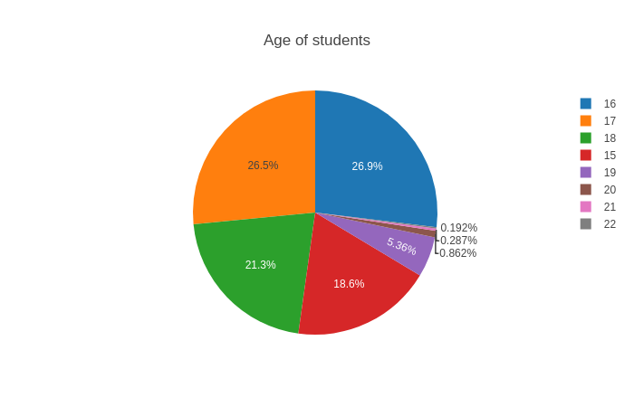

# decisiontreeregression
Visualization Data and Decision Tree Analysis
Decision tree builds regression or classification models in the form of a tree structure. It breaks down a data set into smaller and smaller subsets while at the same time an associated decision tree is incrementally developed. The final result is a tree with decision nodes and leaf nodes.
This is the first time of this project. In this part we will use Decision Tree Regression to study the effect of some factors on the grade of the students. We have an excellent set which contains information about the life of students of some courses and their academic success. As for me, I am very interested to examine in detail the information about the students and find out what influences their grades the
most. The owner of the dataset suggests paying attention to the amount of alcohol consumed by students. This is a really interesting topic. Let’s start. In this part we have 33 columns with 1044 variables each:

schoolStudent’s school (binary: ’GP’ - Gabriel Pereira or ’MS’ - Mousinho da Silveira)
sexStudent’s sex (binary: ’F’ - female or ’M’ - male)
ageStudent’s age (numeric: from 15 to 22)
addressStudent’s home address type (binary: ’U’ - urban or ’R’ - rural)
famsizeFamily size (binary: ’LE3’ - less or equal to 3 or ’GT3’ - greater than 3)
PstatusParent’s cohabitation status (binary: ’T’ - living together or ’A’ - living apart)
MeduMother’s education (numeric: 0 - none, 1 - primary education (4th grade), 2 - 5th to 9th grade, 3 -
secondary education, or 4 - higher education)
FeduFather’s education (numeric: 0 - none, 1 – primary education (4th grade), 2 - 5th to 9th grade, 3 – secondary education, or 4 - higher education)
MjobMother’s job (nominal: ’teacher’, ’health’ care related, civil ’services’ (e.g. administrative or police), ’at home’ or ’other’)
FjobFather’s job (nominal: ’teacher’, ’health’ care related, civil ’services’ (e.g. administrative or police), ’at home’ or ’other’)
reasonReason to choose this school (nominal: close to ’home’, school ’reputation’, ’course’ preference or ’other’)
guardianStudent’s guardian (nominal: ’mother’, ’father’ or ’other’)
traveltimeHome to school travel time (numeric: 1 – 15 min., 2 - 15 to 30 min., 3 - 30 min. to 1 hour, or 4 -1 hour)
studytimeWeekly study time (numeric: 1 - 2 hours, 2 - 2 to 5 hours, 3 - 5 to 10 hours, or 4 - ¿10 hours)
failuresNumber of past class failures (numeric: n if 1=n3, else 4)
schoolsupExtra educational support (binary: yes or no)
famsupFamily educational support (binary: yes or no)
paidExtra paid classes within the course subject (Math or Portuguese) (binary: yes or no)
activitiesExtra-curricular activities (binary: yes or no)
nurseryAttended nursery school (binary: yes or no)
higherWants to take higher education (binary: yes or no)
internetInternet access at home (binary: yes or no)
romanticWith a romantic relationship (binary: yes or no)
famrelQuality of family relationships (numeric: from 1 - very bad to 5 - excellent)
freetimeFree time after school (numeric: from 1 – very low to 5 - very high)
gooutGoing out with friends (numeric: from 1 – very low to 5 - very high)
DalcWorkday alcohol consumption (numeric: from 1 - very low to 5 - very high)
WalcWeekend alcohol consumption (numeric: from 1 - very low to 5 - very high)
healthCurrent health status (numeric: from 1 - very bad to 5 - very good)
absencesNumber of school absences (numeric: from 0 to 93)
G1First period grade (numeric: from 0 to 20)
G2Second period grade (numeric: from 0 to 20)
G3Final grade (numeric: from 0 to 20, output target)

**Libraries we need**
```
import os
import sklearn
import warnings
import numpy as np 
import pandas as pd 
import seaborn as sns
from plotly import tools
import plotly.offline as py
import plotly.graph_objs as go
import matplotlib.pyplot as plt
from sklearn.model_selection import train_test_split
from sklearn.linear_model import LogisticRegression
from plotly.offline import download_plotlyjs, init_notebook_mode, plot, iplot
pd.options.mode.chained_assignment = None
pd.options.display.max_columns = 9999
pd.options.display.float_format = '{:20,.2f}'.format
plt.rc("font", size=14)
sns.set(style="white")
sns.set(style="whitegrid", color_codes=True)
warnings.filterwarnings('ignore')
py.init_notebook_mode(connected=True)
```

**Reading the two data files**
```
# Read data from file 'filename.csv' 
# (in the same directory that your python process is based)
# Control delimiters, rows, column names with read_csv (see later) 
data1 = pd.read_csv("student-por.csv") 
data2 = pd.read_csv("student-mat.csv")
```

**Reading the data columns**
```
data1.columns
```
Index(['school', 'sex', 'age', 'address', 'famsize', 'Pstatus', 'Medu', 'Fedu',
       'Mjob', 'Fjob', 'reason', 'guardian', 'traveltime', 'studytime',
       'failures', 'schoolsup', 'famsup', 'paid', 'activities', 'nursery',
       'higher', 'internet', 'romantic', 'famrel', 'freetime', 'goout', 'Dalc',
       'Walc', 'health', 'absences', 'G1', 'G2', 'G3'],
      dtype='object')
```
data2.columns
```
Index(['school', 'sex', 'age', 'address', 'famsize', 'Pstatus', 'Medu', 'Fedu',
       'Mjob', 'Fjob', 'reason', 'guardian', 'traveltime', 'studytime',
       'failures', 'schoolsup', 'famsup', 'paid', 'activities', 'nursery',
       'higher', 'internet', 'romantic', 'famrel', 'freetime', 'goout', 'Dalc',
       'Walc', 'health', 'absences', 'G1', 'G2', 'G3'],
      dtype='object')
      
**Adding "student-mat.csv" and "student-por.csv" together under the same columns names**
```
frames = [data1, data2]
data = pd.concat(frames)
data.head()
```
	school	sex	age	address	famsize	Pstatus	Medu	Fedu	Mjob	Fjob	reason	guardian	traveltime	studytime	failures	schoolsup	famsup	paid	activities	nursery	higher	internet	romantic	famrel	freetime	goout	Dalc	Walc	health	absences	G1	G2	G3
0	GP	F	18	U	GT3	A	4	4	at_home	teacher	course	mother	2	2	0	yes	no	no	no	yes	yes	no	no	4	3	4	1	1	3	4	0	11	11
1	GP	F	17	U	GT3	T	1	1	at_home	other	course	father	1	2	0	no	yes	no	no	no	yes	yes	no	5	3	3	1	1	3	2	9	11	11
2	GP	F	15	U	LE3	T	1	1	at_home	other	other	mother	1	2	0	yes	no	no	no	yes	yes	yes	no	4	3	2	2	3	3	6	12	13	12
3	GP	F	15	U	GT3	T	4	2	health	services	home	mother	1	3	0	no	yes	no	yes	yes	yes	yes	yes	3	2	2	1	1	5	0	14	14	14
4	GP	F	16	U	GT3	T	3	3	other	other	home	father	1	2	0	no	yes	no	no	yes	yes	no	no	4	3	2	1	2	5	0	11	13	13

```
data.info()
```
<class 'pandas.core.frame.DataFrame'>
Int64Index: 1044 entries, 0 to 394
Data columns (total 33 columns):
school        1044 non-null object
sex           1044 non-null object
age           1044 non-null int64
address       1044 non-null object
famsize       1044 non-null object
Pstatus       1044 non-null object
Medu          1044 non-null int64
Fedu          1044 non-null int64
Mjob          1044 non-null object
Fjob          1044 non-null object
reason        1044 non-null object
guardian      1044 non-null object
traveltime    1044 non-null int64
studytime     1044 non-null int64
failures      1044 non-null int64
schoolsup     1044 non-null object
famsup        1044 non-null object
paid          1044 non-null object
activities    1044 non-null object
nursery       1044 non-null object
higher        1044 non-null object
internet      1044 non-null object
romantic      1044 non-null object
famrel        1044 non-null int64
freetime      1044 non-null int64
goout         1044 non-null int64
Dalc          1044 non-null int64
Walc          1044 non-null int64
health        1044 non-null int64
absences      1044 non-null int64
G1            1044 non-null int64
G2            1044 non-null int64
G3            1044 non-null int64
dtypes: int64(16), object(17)
memory usage: 277.3+ KB
```
# I use final grade = G3, and weekly alcohol consumption = Dalc + Walc 
data.columns
```
Index(['school', 'sex', 'age', 'address', 'famsize', 'Pstatus', 'Medu', 'Fedu',
       'Mjob', 'Fjob', 'reason', 'guardian', 'traveltime', 'studytime',
       'failures', 'schoolsup', 'famsup', 'paid', 'activities', 'nursery',
       'higher', 'internet', 'romantic', 'famrel', 'freetime', 'goout', 'Dalc',
       'Walc', 'health', 'absences', 'G1', 'G2', 'G3'],
      dtype='object')
    
**Modern Corrolation Matrix**
```
plt.figure(figsize=(11,11), dpi= 90, facecolor='w', edgecolor='k')
sns.heatmap(data.corr(),annot = True,fmt = ".2f",cbar = True)
plt.xticks(rotation=90)
plt.yticks(rotation = 0)
plt.savefig('corr.png')
```
 

The number of girls is a little more. We will come back to the gender of students when we consider the final grades of students and so on.
Now let’s pay attention to the age of students. After all, we assume, for example, that the younger the student the less likely that he uses alcohol.
```
ages = data["age"].value_counts()
labels = (np.array(ages.index))
sizes = (np.array((ages / ages.sum())*100))

trace = go.Pie(labels=labels, values=sizes)
layout = go.Layout(title="Аge of students")
dat = [trace]
fig = go.Figure(data=dat, layout=layout)
py.iplot(fig, filename="age")
plt.savefig('age.png')
```


Basically, we are dealing with students 15-18 years. The best, but very often is a difficult age. Teenagers want to relax more with friends and learn less knowledge. Now, let’s see how many hours a week students spend on their studies.

```
data['st_time'] = np.nan
df = [data]

for col in df:
    col.loc[col['studytime'] == 1 , 'st_time'] = '< 2 hours'
    col.loc[col['studytime'] == 2 , 'st_time'] = '2 to 5 hours'
    col.loc[col['studytime'] == 3, 'st_time'] = '5 to 10 hours'
    col.loc[col['studytime'] == 4, 'st_time'] = '> 10 hours'  
 
labels = data["st_time"].unique().tolist()
amount = data["st_time"].value_counts().tolist()

colors = ["pink", "cyan", "green", "yellow"]

trace = go.Pie(labels=labels, values=amount,
               hoverinfo='label+percent', textinfo='value', 
               textfont=dict(size=20),
               marker=dict(colors=colors, 
                           line=dict(color='#000000', width=2)))
dt = [trace]
layout = go.Layout(title="Study Time")

fig = go.Figure(data=dt, layout=layout)
iplot(fig, filename='pie')
plt.savefig('study time.png')
```


The figure above, Show to us Most students spend 2 to 5 and 5 to 10 hours a week studying. It would be better if we had the exact number of hours for each student. Personally, I think a student who spends 5 hours a week studying is a diligent student. 2 hours is not always enough. But we can pay attention to the impact of the number of hours spent on a study on the final grade of the student.

```
sns.catplot(x="address", kind="count",hue = "traveltime",palette="Set2", data=data, height = 6)
plt.title("Students address: U - urban, R - rural")
plt.savefig('Students address.png')
```


As you see, Most of the students live in the city. Few students take long to get to school. let’s see if this affects the number of absences.

```
f= plt.figure(figsize=(9,7))

ax=f.add_subplot(211)
sns.distplot(data[(data.address == 'U')]["absences"],color='Yellow',ax=ax)
ax.set_title('Distribution of absences for students who live is city')

ax=f.add_subplot(212)
sns.distplot(data[(data.address == 'R')]['absences'],color='Green',ax=ax)
ax.set_title('Distribution of absences for students who live in village')
plt.savefig('Distributionofabsencesforstudents.png')
```


Although, among the students living in the village there are people with a lot of absences. But while we can not say for sure that this is due to the fact that the student does not live in the city. But of course, this may be due to traffic jams on the road or not a very good transport schedule.

```
f= plt.figure(figsize=(9,7))

ax=f.add_subplot(211)
sns.distplot(data[(data.romantic == 'no')]["absences"],color='coral',ax=ax)
ax.set_title('Distribution of absences for classes by single people')

ax=f.add_subplot(212)
sns.distplot(data[(data.romantic == 'yes')]['absences'],color='purple',ax=ax)
ax.set_title('Distribution of absences for classes by people in love')
plt.savefig('average.png')
```


